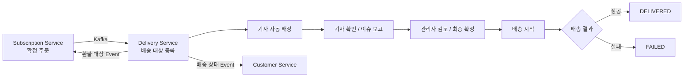
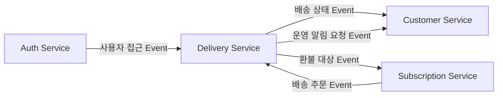

# 🚚 챱챱 Delivery Service

챱챱의 **Delivery Service**는 Subscription Service에서 확정된 배송 주문을 전달받아 배송 대상으로 등록하고, 기사 배정부터 실제 배송 완료·실패까지의 실행 과정을 관리하는 서비스입니다.

주문·결제·환불 정책을 직접 소유하지 않고, **배송 실행에 필요한 상태와 이력, 기사 운영, 현장 결과**에 집중합니다.

---

## 🎯 1. 주요 역할

Delivery Service가 담당하는 핵심 업무는 다음과 같습니다.

- 확정 주문 Kafka Event 수신 및 배송 대상 등록
- 동일 배송일·시간대 기준 전체 배송 그룹 구성
- 기사 업무 활성 상태 및 근무 일정 관리
- 담당 지역·근무 가능 여부·수용량을 기준으로 기사 자동 배정
- 기사 배정 목록 확인 및 이슈 보고
- 관리자 이슈 처리, 재배정 및 최종 확정
- 고객별 배송 시작·완료·실패 처리
- 비대면 배송 완료 사진 관리
- 배송 지연 판정 및 후속 Event 발행
- 고객·기사·관리자별 배송 정보 조회
- 관리자 완료·실패 결과 정정 및 감사 이력 관리
- Kafka Event 처리 실패 조회 및 수동 재발행
- Customer-AI용 현재 배송 상태 Read-only Internal API 제공
- 배송 중 기사 현재 위치 수신 및 고객 대상 SSE 위치 공유
- 기사 휴무 신청 및 관리자 승인

### 🔗 서비스 경계

| 업무 | 담당 서비스 |
|---|---|
| 주문·구독·배송지 원본 | Subscription Service |
| 배송 가능 지역 판정 | Subscription Service |
| 배송 대상 등록·실행 | **Delivery Service** |
| 기사 근무·배정 | **Delivery Service** |
| 배송 진행·완료·실패·지연 | **Delivery Service** |
| 결제·환불·보상·재배송 승인 | Subscription Service |
| 고객·기사·관리자 앱 내 알림 | Customer Service |
| 사용자 계정 및 역할 | Auth Service |

Delivery Service는 다른 서비스의 DB를 직접 조회하거나 수정하지 않습니다.

---

## 🔄 2. 전체 배송 흐름



### 📦 배송 운영 단위

같은 **배송일 + 배송 시간대**의 주문을 하나의 `delivery_group`으로 묶어 운영합니다.

```text
2026-09-24 / LUNCH 배송 그룹
├─ 고객 A 배송
├─ 고객 B 배송
└─ 고객 C 배송
```

한 배송 그룹에는 여러 기사가 참여할 수 있지만, **고객별 배송 대상 하나의 현재 담당 기사는 한 명**입니다.

---

## ⏰ 3. 배송 시간대

모든 배송 업무 판단은 `Asia/Seoul` 기준으로 수행합니다.

| 코드 | 고객 약속 시간 | 지연 시작 |
|---|---|---|
| `LUNCH` | 11:00 ~ 13:00 | 13:01:00 |
| `DINNER` | 17:00 ~ 19:00 | 19:01:00 |

지연은 별도의 배송 상태가 아니라 배송 상태와 함께 관리되는 추가 정보입니다.

---

## 🧭 4. 상태 모델

### 🚦 전체 배송 상태

```text
WAITING_ASSIGNMENT
        ↓
WAITING_RIDER
        ↓
READY_TO_CONFIRM
        ↓
CONFIRMED
        ↓
IN_PROGRESS
   ┌────┼────┐
   ↓    ↓    ↓
COMPLETED
COMPLETED_WITH_FAILURE
FAILED
```

기사 이슈가 발생하면 `ISSUE_REVIEW` 상태를 거쳐 다시 기사 확인 또는 재배정 흐름으로 이어집니다.

| 상태 | 의미 |
|---|---|
| `WAITING_ASSIGNMENT` | 기사 배정 대기 |
| `WAITING_RIDER` | 기사 확인 또는 이슈 보고 대기 |
| `ISSUE_REVIEW` | 관리자 이슈 검토 중 |
| `READY_TO_CONFIRM` | 관리자 최종 확정 가능 |
| `CONFIRMED` | 최종 배송 명단 확정 |
| `IN_PROGRESS` | 하나 이상의 배송 진행 중 |
| `COMPLETED` | 전체 정상 완료 |
| `COMPLETED_WITH_FAILURE` | 성공과 실패가 함께 존재 |
| `FAILED` | 전체 배송 실패 |

### 👨‍🚚 기사 배정 목록 상태

```text
ASSIGNED
 ├─> ACKNOWLEDGED
 ├─> ISSUE_REPORTED
 └─> REASSIGNED
```

최종 확정된 목록은 `CONFIRMED` 상태가 됩니다.

기존 배정 목록의 고객 구성을 직접 수정하지 않고, 재배정이 필요한 경우 기존 목록을 `REASSIGNED`로 종료한 뒤 새 `ASSIGNED` 목록을 생성합니다.

### 📬 고객별 배송 상태

```text
READY → DELIVERING → DELIVERED
   └──────────────→ FAILED
```

`DELIVERED`, `FAILED`는 최종 상태이며 다시 `READY`, `DELIVERING`으로 복구하지 않습니다.

---

## 🤖 5. 기사 자동 배정

자동 배정은 배송 전날 **16:10**부터 시작합니다.

배정에 실패한 배송 그룹은 아래 시각에 다시 시도합니다.

```text
16:10 → 16:20 → 16:30 → 16:40 → 16:50 → 17:00
```

배정 시 다음 조건을 확인합니다.

- 기사 계정 및 접근 가능 상태
- 배송 업무 활성 여부
- 해당 날짜·시간대 근무 가능 여부
- 기사 담당 지역
- 현재 배정된 방문지 수
- 현재 배정된 도시락 수량

### 📊 기사 수용량

| 구분 | 방문지 | 도시락 |
|---|---:|---:|
| 권장 수용량 | 8곳 | 36개 |
| 최대 수용량 | 10곳 | 42개 |

최대 수용량은 자동 배정과 관리자 수동 배정 모두 초과할 수 없습니다.

자동 배정은 **전체 배송 대상을 모두 배정할 수 있을 때만 성공**합니다. 한 건이라도 배정할 수 없다면 해당 시도의 부분 배정 결과를 저장하지 않습니다.

---

## 🛠️ 6. 주요 기능

| 기능 ID | 기능 |
|---|---|
| `F-DLV-001` | 확정 주문 수신 및 배송 대상 등록 |
| `F-DLV-002` | 기사 업무 활성 및 근무 일정 |
| `F-DLV-003` | 기사 자동 배정·수용량·기사 결정 |
| `F-DLV-004` | 관리자 최종 확정 |
| `F-DLV-005` | 고객별 배송 시작 |
| `F-DLV-006` | 고객별 배송 완료 |
| `F-DLV-007` | 고객 부재 및 배송 실패 |
| `F-DLV-008` | 배송 지연 판정 및 후속 처리 |
| `F-DLV-009` | 전체 배송 상태 자동 계산 |
| `F-DLV-010` | 역할별 배송 조회 |
| `F-DLV-011` | 관리자 완료·실패 정보 정정 |
| `F-DLV-012` | Event 처리 실패 확인 |
| `F-DLV-014` | 기사·관리자 운영 알림 요청 |
| `F-DLV-015` | Customer-AI 현재 대표 배송 조회 |
| `F-DLV-016` | 기사 휴무 신청·승인 |
| `F-DLV-017` | 실시간 기사 현재 위치 공유 |

---

## 🧩 7. 기술 스택

| 영역 | 기술 |
|---|---|
| Language | Java 21 |
| Framework | Spring Boot |
| Web | Spring Web MVC |
| Security | Spring Security |
| Validation | Spring Validation |
| ORM | Spring Data JPA |
| Database | MySQL 8.x |
| Messaging | Apache Kafka / Spring Kafka |
| Object Storage | MinIO |
| Realtime | Server-Sent Events (SSE) |
| API Docs | SpringDoc OpenAPI / Swagger UI |
| Build | Gradle |
| Container | Docker |
| Deployment | Kubernetes |
| CI/CD | GitHub Actions / ArgoCD |

정확한 Spring Boot 및 라이브러리 버전은 저장소의 `build.gradle`을 기준으로 확인합니다.

---

## 🌐 8. API

### 🔐 외부 API

Gateway 기준 Delivery Service의 외부 API 경로는 다음과 같습니다.

```text
/api/delivery/**
```

로컬 개발 기준 Delivery Service 포트는 다음과 같습니다.

```text
8083
```

외부 클라이언트는 하위 서비스에 직접 접근하지 않고 API Gateway를 통해 요청합니다.

```text
API Gateway: http://localhost:8080
Delivery:    /api/delivery/**
```

Gateway는 JWT를 검증한 뒤 내부 요청에 사용자 문맥을 전달합니다.

```http
X-User-Id: {userId}
X-User-Role: CUSTOMER|RIDER|ADMIN
```

Delivery Service는 역할만 확인하는 것이 아니라 고객 본인 소유권, 현재 담당 기사 관계, Delivery 접근 Projection 등을 다시 검증합니다.

### 📤 공통 응답

```json
{
  "code": "00",
  "message": "SUCCESS",
  "data": {}
}
```

오류 코드는 Delivery 도메인 기준으로 `DELIVERY_###` 형식을 사용합니다.

---

## 📘 9. Swagger / OpenAPI

SpringDoc OpenAPI 문서는 다음 경로에서 확인합니다.

```text
OpenAPI JSON : /api-docs
Swagger UI   : /swagger-ui.html
```

통합 Swagger UI는 Gateway의 `/docs` 구성을 사용할 수 있으며, 실제 노출 경로는 Gateway 및 배포 환경 설정을 기준으로 확인합니다.

---

## 📨 10. Kafka 연동

Delivery Service는 서비스 간 일반 업무 연동을 Kafka Event 중심으로 처리합니다.



### 🧵 주요 Topic

| 방향 | Topic | 용도 |
|---|---|---|
| Auth → Delivery | `msa4-team1.auth.user-events.v1` | 역할 변경·탈퇴·관리자 활성/비활성 |
| Subscription → Delivery | `msa4-team1.subscription.delivery-orders.v1` | 다음 날 확정 배송 주문 |
| Delivery → Customer | `msa4-team1.delivery.delivery-events.v1` | 배송 생성·시작·지연·완료·실패 |

주문 Event:

```text
SUBSCRIPTION_DELIVERY_ORDER_READY
```

배송 Event:

```text
DELIVERY_CREATED
DELIVERY_STARTED
DELIVERY_DELAYED
DELIVERY_COMPLETED
DELIVERY_FAILED
```

Kafka Event는 `eventId`를 이용해 중복 처리를 방지하며, 최종 Consumer 실패는 원본 Topic의 `.DLT`로 분리합니다.

> 기사 실시간 위치는 Kafka Event로 전달하지 않습니다. 고빈도 현재 상태 데이터이므로 Delivery Service 내부 HTTP 갱신 + 고객 SSE 방식으로 처리합니다.

---

## 📍 11. 실시간 기사 위치

배송 중인 기사는 현재 위치를 Delivery Service에 HTTP로 갱신합니다.

Delivery Service는 기사별 최신 위치 **1건만** 관리하고, 해당 기사가 담당하는 `DELIVERING` 상태의 고객에게 SSE로 위치를 전달합니다.

```text
Rider
  │
  │ HTTP 위치 갱신
  ▼
Delivery Service
  │
  ├─ rider_current_locations 갱신
  │
  └─ SSE fan-out
         │
         ▼
      Customer
```

현재 MVP에서는 다음 기능을 제공하지 않습니다.

- GPS 위치 History
- 이동 경로 Polyline
- ETA 계산
- GPS 기반 기사 배정
- Redis 기반 분산 위치 전달
- GPS Kafka Event
- 관리자 실시간 기사 관제

---

## 🗄️ 12. 데이터베이스

DBMS는 **MySQL 8.x**를 사용합니다.

Delivery Service는 DB 물리 `FOREIGN KEY` 제약을 생성하지 않고 서비스 계층과 로컬 트랜잭션을 통해 논리적 참조 관계를 관리합니다.

### 🧱 주요 테이블

| 영역 | 테이블 |
|---|---|
| 배송 시간대 | `delivery_slots` |
| 전체 배송 | `delivery_groups` |
| 고객별 배송 | `deliveries` |
| 수령 정보 | `delivery_recipient_snapshots` |
| 배송 상태 이력 | `delivery_status_histories` |
| 기사 | `riders` |
| 기사 근무 일정 | `rider_weekly_schedules` |
| 예외 일정 | `rider_schedule_exceptions` |
| 기사 휴무 신청 | `rider_leave_requests` |
| 담당 지역 | `rider_delivery_areas` |
| 배송 지역 코드 | `delivery_area_codes` |
| 기사 배정 목록 | `delivery_assignments` |
| 배정 대상 | `delivery_assignment_items` |
| 배정 이슈 | `delivery_assignment_issues` |
| 배송 완료 | `delivery_completions` |
| 배송 실패 | `delivery_failures` |
| 완료 사진 | `delivery_completion_photos` |
| 배송 지연 | `delivery_delays` |
| 결과 정정 | `delivery_result_corrections` |
| 관리자 장애 복구 | `delivery_admin_recoveries` |
| Kafka 처리 기록 | `integration_event_records` |
| 감사 이력 | `audit_histories` |
| 접근 Projection | `delivery_access_profiles` |
| 기사 현재 위치 | `rider_current_locations` |

---

## 📸 13. 완료 사진

비대면 배송 완료 시 필요한 사진은 Delivery Service가 직접 받아 MinIO에 저장합니다.

- 저장소: MinIO
- 팀 공용 Bucket: `msa4-team1`
- 객체 경로:

```text
delivery/completion-photos/{deliveryPublicId}/{uuid}
```

DB에는 Bucket 이름이 아닌 객체 경로만 저장합니다.

사진 조회는 권한 검증 후 Presigned GET URL 방식으로 제공하며, URL 유효시간은 **10분**입니다.

---

## 🔒 14. 동시성 및 데이터 정합성

주요 상태 변경과 배정 작업에는 비관적 락 또는 현재 상태 조건 UPDATE를 사용합니다.

주요 비관적 락 순서는 다음 기준을 따릅니다.

```text
delivery_groups
→ riders
→ deliveries
→ delivery_assignments
→ delivery_assignment_items
```

중복 데이터는 주로 다음 방식으로 방지합니다.

- `PRIMARY KEY`
- `UNIQUE`
- Kafka `eventId`
- 주문 `orderId`
- 현재 상태 조건 UPDATE
- 로컬 트랜잭션

완료·실패 원본 데이터는 직접 덮어쓰지 않고 별도의 정정 이력을 추가합니다.

---

## 🚧 15. MVP 범위 밖

다음 기능은 현재 Delivery Service MVP에서 제공하지 않습니다.

- 주문 생성·변경·취소
- 배송 가능 지역 판정
- 결제·환불 금액 계산 및 결제 취소
- 외부 배송업체 연동
- 전체 배송 경로 최적화
- GPS 위치 이력 및 이동 경로
- 배송 중 기사 재배정
- 차량 등록·배정·점검 관리
- 실패 회차 재배송
- 최종 상태(`DELIVERED`, `FAILED`) 복구
- Transactional Outbox
- Kafka DLT 자동 재처리 화면
- Customer Service가 소유하는 알림 템플릿·읽음 상태 관리

---

## 💻 16. 로컬 개발 참고

Delivery Service의 로컬 포트 기준은 `8083`입니다.

```text
API Gateway      : 8080
Auth Service     : 8081
Subscription     : 8082
Delivery Service : 8083
Customer Service : 8084
```

정확한 애플리케이션 실행 명령, DB/Kafka/MinIO 접속 정보 및 환경변수 이름은 이 README에서 임의로 정의하지 않습니다.

다음 실제 저장소 설정을 우선합니다.

```text
build.gradle
application.yml / application-*.yml
.env 또는 배포 환경변수 정의
Docker / Docker Compose 설정
Kubernetes Manifest
GitHub Actions Workflow
```

> `.env`와 비밀 키는 Git에 커밋하지 않습니다.

---

## ✅ 17. 테스트 및 확인

개발 시 아래 항목을 함께 확인합니다.

- 단위·통합 테스트
- Swagger UI API 요청/응답 확인
- Postman 수동 API 테스트
- MySQL 데이터 및 상태 이력 확인
- Kafka Producer / Consumer 연동 확인
- 중복 Event 처리 확인
- DLT 및 발행 실패 기록 확인
- 기사 자동 배정 수용량 검증
- 완료 사진 MinIO 저장 및 접근 권한 확인
- mock GPS 기반 HTTP/SSE 통합 확인
- 활성 화면·권한·Secure Context에서 실제 위치 공유 기본 흐름 확인

---

## 🧑‍💻 18. 개발 규칙

백엔드는 도메인 중심 구조를 사용합니다.

```text
com.chapchap.delivery
├─ domain
│  └─ {domain}
│     ├─ controller
│     ├─ service
│     ├─ repository
│     ├─ entity
│     ├─ request
│     └─ response
└─ global
   ├─ config
   ├─ security
   ├─ exception
   ├─ kafka
   └─ response
```

주요 원칙:

- Controller에서 Repository를 직접 호출하지 않습니다.
- Entity를 API 응답으로 직접 반환하지 않습니다.
- 조회 전용 Service는 `@Transactional(readOnly = true)`를 사용합니다.
- 상태값과 사유는 문자열 상수가 아닌 업무별 Enum으로 관리합니다.
- Kafka Consumer는 수신 후 Service에 처리를 위임합니다.
- 다른 서비스 DB를 직접 조회하지 않습니다.
- 민감 정보와 Token을 로그 또는 Event에 노출하지 않습니다.

---

## 📚 19. 관련 문서

상세 정책과 계약은 아래 문서를 기준으로 합니다.

- `챱챱_배달_정책.md`
- `챱챱_Delivery_Service_요구사항_명세서.md`
- `챱챱_Delivery_Service_기능_명세서.md`
- `챱챱_Delivery_Service_DB_ERD_설계서.md`
- `챱챱_Delivery_Service_Kafka_설계서.md`
- `챱챱_Delivery-Service_API_명세서.md`
- `챱챱_기술스택.md`
- `챱챱코드컨벤션.md`

문서와 실제 설정이 다를 경우 **실제 저장소 설정 파일과 최신 확정 계약을 우선**하고 관련 문서를 함께 갱신합니다.
